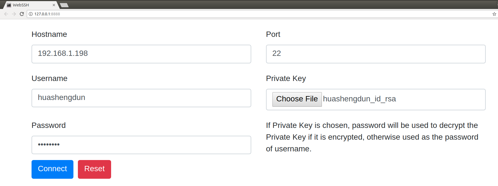
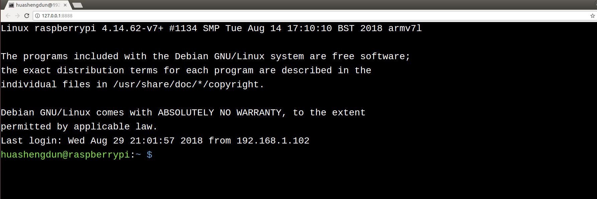

## WebSSH

[](https://github.com/huashengdun/webssh/actions/workflows/python.yml)
[](https://raw.githubusercontent.com/huashengdun/webssh/coverage-badge/coverage.svg)


### Introduction

A simple web application to be used as an ssh client to connect to your ssh servers. It is written in Python, base on tornado, paramiko and xterm.js.

### Features

* SSH password authentication supported, including empty password.
* SSH public-key authentication supported, including DSA RSA ECDSA Ed25519 keys.
* Encrypted keys supported.
* Two-Factor Authentication (time-based one-time password) supported.
* Fullscreen terminal supported.
* Terminal window resizable.
* Auto detect the ssh server's default encoding.
* Modern browsers including Chrome, Firefox, Safari, Edge, Opera supported.


### Preview





### How it works
```
+---------+     http     +--------+    ssh    +-----------+
| browser | <==========> | webssh | <=======> | ssh server|
+---------+   websocket  +--------+    ssh    +-----------+
```

### Requirements

* Python 3.8+


### Quickstart

1. Install this app, run command `pip install webssh`
2. Start a webserver, run command `wssh`
3. Open your browser, navigate to `127.0.0.1:8888`
4. Input your data, submit the form.


### Server options

```bash
# start a http server with specified listen address and listen port
wssh --address='2.2.2.2' --port=8000

# start a https server, certfile and keyfile must be passed
wssh --certfile='/path/to/cert.crt' --keyfile='/path/to/cert.key'

# missing host key policy
wssh --policy=reject

# logging level
wssh --logging=debug

# log to file
wssh --log-file-prefix=main.log

# more options
wssh --help
```

### Browser console

```javascript
// connect to your ssh server
wssh.connect(hostname, port, username, password, privatekey, passphrase, totp);

// pass an object to wssh.connect
var opts = {
  hostname: 'hostname',
  port: 'port',
  username: 'username',
  password: 'password',
  privatekey: 'the private key text',
  passphrase: 'passphrase',
  totp: 'totp'
};
wssh.connect(opts);

// without an argument, wssh will use the form data to connect
wssh.connect();

// set a new encoding for client to use
wssh.set_encoding(encoding);

// reset encoding to use the default one
wssh.reset_encoding();

// send a command to the server
wssh.send('ls -l');
```

### Custom Font

To use custom font, put your font file in the directory `webssh/static/css/fonts/` and restart the server.

### URL Arguments

Support passing arguments by url (query or fragment) like following examples:

Passing form data (password must be encoded in base64, privatekey not supported)
```bash
http://localhost:8888/?hostname=xx&username=yy&password=str_base64_encoded
```

Passing a terminal background color
```bash
http://localhost:8888/#bgcolor=green
```

Passing a terminal font color
```bash
http://localhost:8888/#fontcolor=red
```

Passing a user defined title
```bash
http://localhost:8888/?title=my-ssh-server
```

Passing an encoding
```bash
http://localhost:8888/#encoding=gbk
```

Passing a font size
```bash
http://localhost:8888/#fontsize=24
```

Passing a command executed right after login
```bash
http://localhost:8888/?command=pwd
```

Passing a terminal type
```bash
http://localhost:8888/?term=xterm-256color
```

### Use Docker

Start up the app
```
docker-compose up
```

Tear down the app
```
docker-compose down
```

### Tests

Requirements
```
pip install pytest pytest-cov codecov flake8 mock
```

Use unittest to run all tests
```
python -m unittest discover tests
```

Use pytest to run all tests
```
python -m pytest tests
```

### Deployment

Running behind an Nginx server

```bash
wssh --address='127.0.0.1' --port=8888 --policy=reject
```
```nginx
# Nginx config example
location / {
    proxy_pass http://127.0.0.1:8888;
    proxy_http_version 1.1;
    proxy_read_timeout 300;
    proxy_set_header Upgrade $http_upgrade;
    proxy_set_header Connection "upgrade";
    proxy_set_header Host $http_host;
    proxy_set_header X-Real-IP $remote_addr;
    proxy_set_header X-Real-PORT $remote_port;
}
```

Running as a standalone server
```bash
wssh --port=8080 --sslport=4433 --certfile='cert.crt' --keyfile='cert.key' --xheaders=False --policy=reject
```


### Tips

* For whatever deployment choice you choose, don't forget to enable SSL.
* By default plain http requests from a public network will be either redirected or blocked and being redirected takes precedence over being blocked.
* Try to use reject policy as the missing host key policy along with your verified known_hosts, this will prevent man-in-the-middle attacks. The idea is that it checks the system host keys file("~/.ssh/known_hosts") and the application host keys file("./known_hosts") in order, if the ssh server's hostname is not found or the key is not matched, the connection will be aborted.
